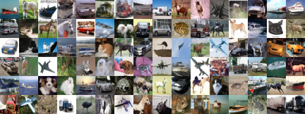
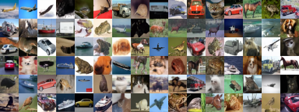

# rin-pytorch

PyTorch implementation of [Recurrent Interface Network (RIN)](https://arxiv.org/abs/2212.11972).
The codebase is largely a translation of the Tensorflow code of the original authors ([google-research/pix2seq](https://github.com/google-research/pix2seq)) and it should behave almost identically (even transferring weights is possible).
Some simplifications have been made, removing unused code and options. In the current state, the code is optimized for class-guided image generation, but it should be easy to adapt it to other tasks.

The model is implemented using [Keras Core](https://keras.io/keras_core/) with the PyTorch backend as this made the translation of the original Tensorflow code relatively straightforward as it was also using the Keras API.

The training logic is adapted from [lucidrains/recurrent-interface-network-pytorch](https://github.com/lucidrains/recurrent-interface-network-pytorch).

## Usage

```python
import torchvision

from rin_pytorch import Rin, RinDiffusionModel, Trainer

rin = Rin(**rin_config).cuda()
rin.pass_dummy_data(num_classes=10)  # populate lazy model with weights
diffusion_model = RinDiffusionModel(rin=rin, **diffusion_config)

# also create an EMA model
rin_ema = Rin(**rin_config).cuda()
rin_ema.pass_dummy_data(num_classes=10)
ema_diffusion_model = RinDiffusionModel(rin=rin_ema, **diffusion_config)

dataset = ...

trainer = Trainer(
    diffusion_model,
    ema_diffusion_model,
    dataset,
    **trainer_config,
)

trainer.train()
```

Refer to `train_cifar10.py` file for an example of how to train a model on CIFAR-10.
From that, it should be clear how to adapt the code to other datasets and configs.

## Examples

The following samples are generated using the same hyperparameters as the original authors for the CIFAR-10 dataset.

#### Samples from PyTorch model trained using this codebase (DDIM @ 100 steps):



#### Samples from Tensorflow model trained using the pix2seq codebase (DDIM @ 100 steps):

